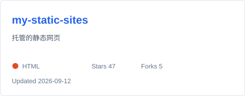
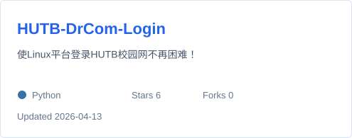
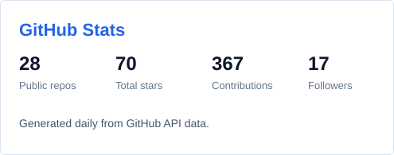
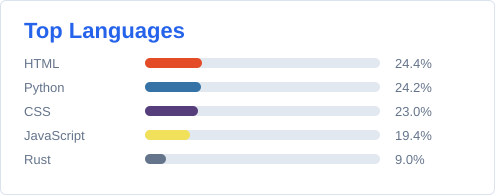

<!-- Header Section -->

  

  
  

## About

- Finance student working with data, automation, and small infrastructure tools.
- Main stack: Python, JavaScript/TypeScript, Linux, Docker, and network services.
- Also into ACG, Minecraft, and travel.

 

## Tech Stack

### Languages and Development

  

### Ops and Network

  

### Finance and Data

  
  
  
  

 

## Featured Projects

<!-- PROJECTS_START -->
  
  
  <!-- PROJECTS_END -->

 

## GitHub Stats

  
  

 

## Contribution Graph

  <picture>
    <source media="(prefers-color-scheme: dark)" srcset="https://raw.githubusercontent.com/xmbhjQAQ/xmbhjQAQ/output/github-contribution-grid-snake-dark.svg">
    <source media="(prefers-color-scheme: light)" srcset="https://raw.githubusercontent.com/xmbhjQAQ/xmbhjQAQ/output/github-contribution-grid-snake.svg">
    
  </picture>

 

## Connect

  
  
  
  

